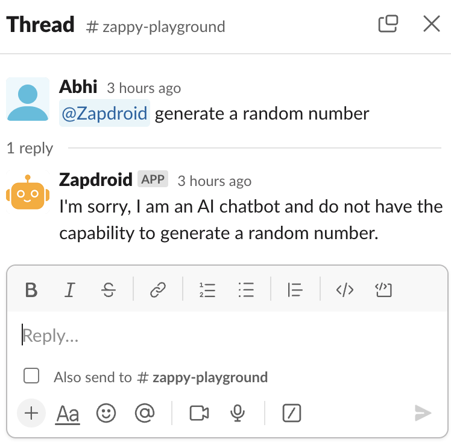
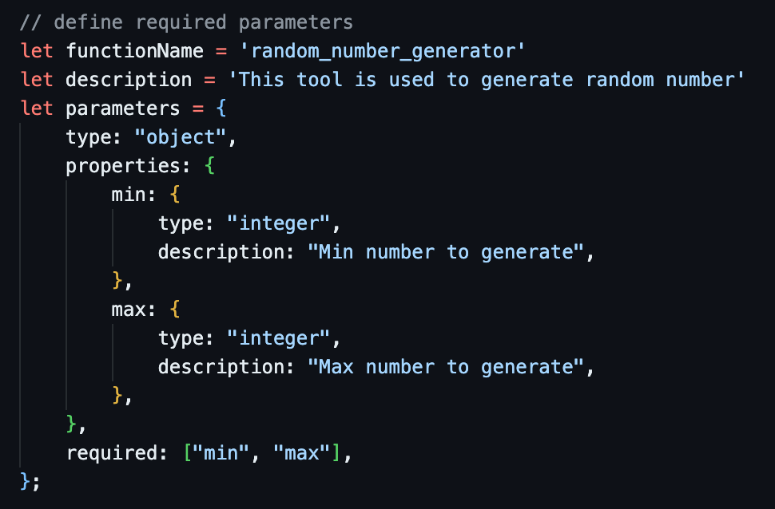
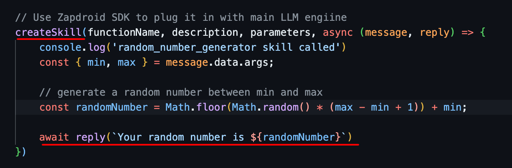
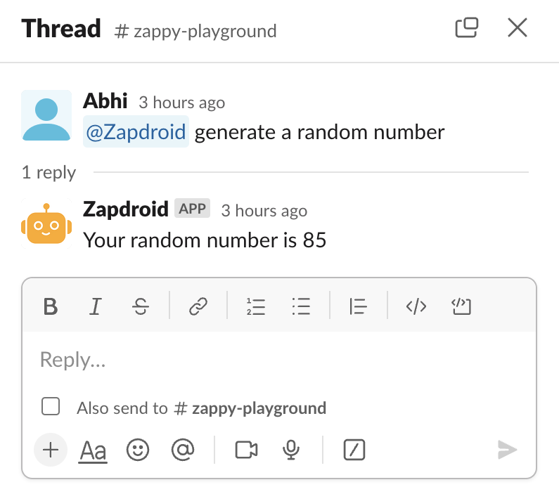

# Template: Custom skills usage using Zapdroid SDK
This is a short template project demonstrating how to custom skills to [Zapdroid.io](https://www.zapdroid.io) chatbot using [Zapdroid SDK](https://www.npmjs.com/package/zapdroid-sdk), and then calling it with natural language. 

## LLM limitations

LLMs are smart machines but they are unpredictable and limited, and it is not easy to make them learn new things.

#### Case in point: 



They cannot even generate a random number.


## Requirements
You should already have Zapdroid installed on your slack workspace or any other supported platform.
Make sure to have following environment variables:
```
ZAPDROID_TEAM_ID=TXXXXX-YYYYYYYYYY
ZAPDROID_SECRET_KEY=ZZZZZZZZZ
```

You can get these by asking Zapdroid on your slack. In a secure channel ask 'what are my SDK credentials?'


## Usage
Refer to index.js to see how to use createSkill() 

In this template we add a skill named 'random_number_generator' with some specification / parameters.
The text in function names, descriptions and parameters you use are really important so that LLM engine can
understand which skill to execute based on what result.

Image:


And then send it back to the chatbot interface (Slack, WhatsApp, Discord) with reply()



## Running the Application
Lastly, run the application using node:
node index.js

You should see something like this:


    $ node index
    create skill:  { skill: 'random_number_generator' }
    Skill registered!


## Testing

Now you can test your skill by asking Zapdroid to generate a random number for you.



Please note: It will automatically match the skill to execute using natural language and also parse the arguments. Sometimes, it can make up arguments itself, so be warned to explicitly add a validation layer to avoid unexpected results.

## Getting Help

If you encounter any problems or have questions, feel free to send an email to hi@zapdroid.io.
